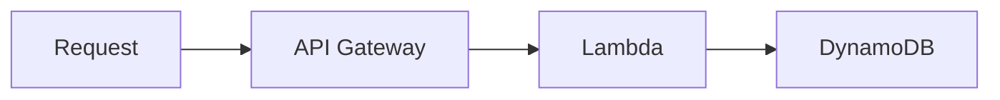
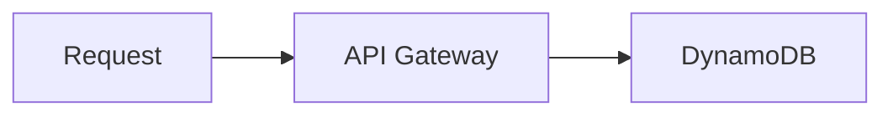

# API Gateway DyanmoDB Proxy Service

Demo for API Gateway with DynamoDB proxy service. This allows CRUD for DynamoDB records without the need for a lambda.

## Requirements

- Node v20
- AWS CLI
- [VSCode Mermaid](https://marketplace.visualstudio.com/items?itemName=vstirbu.vscode-mermaid-preview) (optional)

## Installation

```
yarn
```

## Deploy

Reference [AWS CLI configuration](https://docs.aws.amazon.com/cli/latest/userguide/cli-chap-configure.html) or simply set the following environment variables: `AWS_ACCESS_KEY_ID` and `AWS_SECRET_ACCESS_KEY`.

Once your CLI is configured, run the following command to deploy:

```
yarn deploy
```

## Destroy

Run the following command to remove all resources deployed to your AWS account:

```
yarn destroy
```

## Test

For convenience, import the [Postman collection and environment](https://learning.postman.com/docs/getting-started/importing-and-exporting/importing-and-exporting-overview/) found in `./postman` directory.

After importing, set the `BASE_URL` to your API Gateway url (ex: `https://<api-gateway-id>.execute-api.<region>.amazonaws.com/<stage>`).

|Paths|Method|Description|
|---|---|---|
|`/example`|GET|Endpoint driven from Lambda using [Serverless Framework](https://www.serverless.com/framework/docs/providers/aws/guide/functions)|
|`/todos`|GET|Get all todos|
|`/todos/{todoId}`|GET|Get todo item|
|`/todos/{todoId}`|PUT|Put todo item|
|`/todos/{todoId}`|DELETE|Delete todo item|

## How It Works

A typical setup for API Gateway uses lambda to insert records into DynamoDB.



The `/todos` endpoint leverages the API Gateway with DynamoDB proxy service to map data and write the record directly to DynamoDB.

